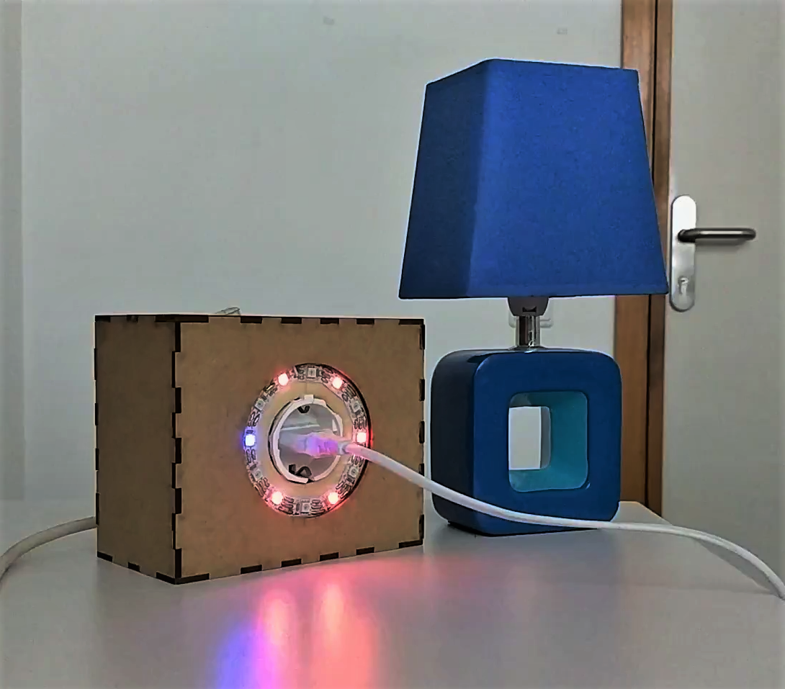

# Repositories for the Wattom plug

### Arduino-EnergyLab-Led :
Arduino code which receives commands from the intel edison microrpocessor (using I2C) and adjusts the colors of a neo pixel ring accordingly

### EnergyMonitorPython-master :
Python module responsible for measuring the electricity consumption and events, and communicating with Arduino module to change the LED colors. This modules also interacts with a Relay to cut the flow of electricity

### Node-Server-Plugs-master :
Node.js server which works like a broker handling the requests from client applications regarding each Wattom device, it has services to return consumption, events, change colors, start motion, turning the plug ON/OFF ,...

### Design and schematics
Wattom uses a set of hardware components described at https://www.instructables.com/id/Create-a-Plug-to-Monitor-Power-Consumption-With-In/. The code in these repositories is up to date, however, it is important to note that other components might be necessary in order to replicate the system. An arduino microprocessor is needed to control the neopixel led ring, this micro-controller uses I2C to communicate with the edison system. This connection is made in PIN8 on the arduino and GPIO20 on the edison.
